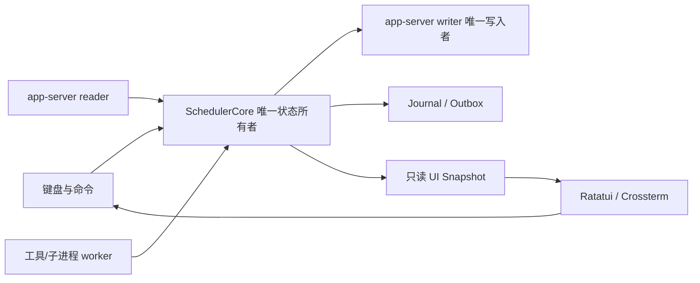

# Agent 工作台共享调度模型

状态：V2 调度目标设计；更新：2026-10-03。V1/Alpha 范围与 journal 观察恢复见[产品计划](native-agent-tui-plan.md)和[可观测性契约](native-agent-tui-observability.md)。已有 Gate/child 能力保持回归，不要求重做或删除。

本文 V2 指产品阶段，不指 Codex app-server 的协议版本。共享 DAG 的 Any/Quorum 等策略属于后续扩展；当前原生 wait 的释放条件仍是全部绑定轮次完成或任一失败/中断。

> **这是 Core/UI 的共享调度模型。** Core 负责任务事实、依赖、资源、Gate、持久化和恢复；UI 只观察快照并提交明确的调度命令。app-server V2 使用这个模型，但通过 stdio JSON-RPC 适配器执行 Codex 线程和原生子代理。直连 Responses 的自研 runtime 可以复用这个模型，属于后续适配器，不改变这里的任务和 Gate 语义。

本设计接续[产品计划](native-agent-tui-plan.md)。它把“可看到代理状态”扩展为“可以观察、暂停、恢复、取消和重排工作流”。本文中的并发上限、优先级、缓存大小和预算都是配置项或验收参数，不代表当前 app-server 或模型服务已经提供了这些保证。

## 1. 目标和 V2 边界

工作台的本地调度器需要同时处理三类事实：任务 DAG 的依赖事实、app-server/工具的执行事实，以及用户的调度命令。模型输出、普通日志和 UI 动画都不能直接改变任务终态。调度器要支持一个根工作流及其 1–3 个并行子代理，保持现有“等待子代理期间不产生新的父模型请求”契约，并让慢 UI 不阻塞协议和 Gate。

app-server V2 的边界如下：

- 一个 TUI 进程持有一个 app-server 子进程；一个 `SchedulerCore` 是任务、Gate、资源和 pending RPC 的唯一执行所有者。
- 一个工作流有一个根 Agent task。共享模型可以表达任意层次的 DAG，但 V2 只接受根任务和直属原生子代理；深层动态委派、多个根工作流、跨进程 attach 和热接管旧 Python 客户端先标记为不支持。
- V2 只用已经锁定 schema 的 stdio JSON-RPC 和已验证的 dynamic-tools 能力。未知请求或影响生命周期的未知事件进入明确的兼容错误；无关 telemetry 可诊断记录但不推进状态。版本不匹配禁止未经验证的执行，不能用文本推断或无限重试兜底。
- TUI 退出表示执行所有者退出。V2 不承诺 detach 后任务继续，也不从另一个客户端 `thread/resume` 正在由其他进程控制的活动会话。
- 任务调度、日志聚合、审批弹窗和 UI 重排都不能调用模型或发起轮询。只有任务状态机允许的 adapter command 可以发出 app-server 请求。

任务 DAG 是 Core 的稳定模型，app-server V2 的一层限制属于 adapter policy。未来支持嵌套代理或直连 Responses 时，不应重新定义 UI 状态，而应增加新的执行映射和恢复规则。

### V1 先行的观察恢复

S9a 的 session journal/schema/游标先于持久 JSONL 流交付，不必等待本文件完整 DAG、resource ledger 和 outbox。默认保存到用户数据目录，30 天/500 MB 上限、脱敏、范围截断和只读回放按可观测性契约执行。V2 再扩展调度记录。所有 shell/file 工具仍通过 app-server，本文 tool worker/slot 表示受支持操作的跟踪与预算，不另建绕过审批的直接执行路径。

## 2. 所有权和消息边界



`SchedulerCore` 串行处理 `Command` 和 `Event`，唯一修改任务图、ready queue、Gate、资源账本和 outbox。网络 reader、工具 worker 和 journal writer 不直接修改核心状态；它们只投递带有来源和序号的消息。UI 只持有不可变 snapshot 和有界日志段，不能持有核心锁等待绘制，也不能绕过 Core 写 RPC。

建议的边界接口：

```text
SchedulerCore::submit(Command) -> CommandAccepted | CommandRejected
SchedulerCore::apply(Event) -> Vec<Effect>
SchedulerCore::snapshot() -> UiSnapshot
SchedulerCore::replay(JournalRecord) -> Result<()>
```

`Effect` 由 adapter、工具 runner、journal/outbox 和 UI publisher 分别消费。Effect 必须带 `workflow_id`、`task_id`、`attempt_id`，涉及模型或工具请求时还要带外部身份和本地 generation。核心不 await 慢的 effect；effect 的结果作为新 Event 回到核心。

## 3. 任务、依赖和状态

### 3.1 任务记录

每个任务至少保存：

| 字段 | 用途 |
| --- | --- |
| `workflow_id`、`task_id` | 稳定的本地工作流和任务身份 |
| `parent_task_id` | 本地父子层级；根任务为空 |
| `kind` | `RootAgent`、`ChildAgent`、`Tool`、`Join`、`Approval` 等 |
| `dependencies` | 前置任务、边策略和失败处理 |
| `state`、`blocked_reason` | 本地调度事实及机器可读原因 |
| `priority`、`ready_seq` | 优先级和公平排队顺序 |
| `attempt_no`、`attempt_id`、`generation` | 区分重试和迟到事件 |
| `resource_request`、`budget` | 槽位、工具、时间和 token/usage 预算 |
| `retry_policy` | 可重试错误、最大次数和退避设置 |
| `external_ref` | `threadId`、`turnId`、`itemId`、`serverRequestId` 等 adapter 身份 |
| `timestamps`、`last_event_seq` | 队列、执行、终态和新鲜度显示 |
| `result_ref`、`error` | 结构化结果、错误码和日志位置 |

任务状态应区分等待和阻塞：

```text
Draft -> Queued -> Ready -> Running
Running -> WaitingChildren | WaitingApproval | Succeeded | Failed | Cancelled | Unknown
WaitingChildren -> Running | Succeeded | Failed | Cancelled | Unknown
WaitingApproval -> Running | Failed | Cancelled
Ready/Queued -> Paused | Blocked | Cancelled
Failed/Unknown -> 用户确认 -> 新 attempt -> Ready
Ready/Queued -> Paused；运行中暂停只阻止新派发，不伪造运行已冻结
```

`Queued` 表示还没有进入就绪队列或正在等待调度公平性；`Ready` 表示依赖已经满足、只等待资源或取出；`Blocked` 表示有明确外部原因不能运行；`WaitingChildren` 表示父任务已经把当前响应交给 Gate，等待确定的子任务终态。`Unknown` 表示连接、进程或写入结果不明，不能等同于失败，也不能自动重跑有副作用的工具。

### 3.2 DAG 依赖

创建或修改边时进行环检测。每个任务维护必需前驱的未完成计数和失败计数，并维护反向邻接表；前驱终态到达时只更新直接后继，不扫描整张图。

依赖策略使用有限集合：

- `AllRequired`：所有必需前驱成功才就绪。
- `Any`：任一前驱满足终态即可；其余未启动任务可以标记 `Skipped`。
- `Quorum(n)`：达到成功数后进入就绪，剩余任务按策略取消或继续收集。
- `CollectAll`：等待全部前驱，成功和失败一起交给 Join。

边还要指定失败处理：`FailFast`、`ContinueWithErrors` 或 `Optional`。父任务失败不应隐式删除子图；应将后继标记为 `Skipped(parent_failed)` 或 `Blocked(dependency_failed)`，让 UI 和恢复逻辑能区分“没运行”和“运行失败”。

## 4. Ready queue、优先级和资源槽

### 4.1 就绪队列

调度器只把依赖满足、未暂停、未超过 deadline 且预算可用的任务放入 ready queue。队列键至少包含显式优先级、等待时间、workflow 权重和 `ready_seq`。采用优先级 aging 或加权公平轮转，避免一个不断产生高优先级子任务的 workflow 饿死其他 workflow。

优先级只影响尚未运行的任务。运行中任务不被 UI 重排；要停止它必须走取消或协作式暂停路径。重排操作只修改 ready queue 的优先级/序号并写入 audit journal，不能跳过依赖。

### 4.2 层级槽位

资源账本采用可配置的加权槽位，而不是在各组件内分散计数：

| 槽位 | 控制对象 |
| --- | --- |
| `global_agent` | 工作流中同时运行的 Agent turn |
| `workflow_agent` | 单个工作流的并发子代理 |
| `model/provider` | 某模型或 provider 的并发与限流 |
| `tool` | 工具调用总数或工具类型并发 |
| `shell/process` | Windows shell/子进程数量及其输出预算 |
| `journal/io` | 可选的持久化和日志写入背压 |

任务开始前一次性预留所需槽位，所有权写入 `Reservation`；终态或取消事件只释放本 `attempt_id` 的 reservation。重复终态不得重复释放。等待子代理、审批或网络输入时释放 `global_agent`，但保留任务和 Gate 记录；这样父任务不会占住模型槽，也不会丢失等待关系。

槽位不足显示为 `Blocked(no_slot)` 或继续留在 `Queued`，由产品决定是否让用户手动强制提高优先级。强制操作仍不能超过硬上限。模型服务的 lane 限制、app-server 的实际限制和本机 shell 能力要通过配置及运行时错误处理，不在 UI 中伪造一个更高的容量。

预算包括最大并发、最大 attempts、墙钟 deadline、工具输出字节、日志保留字节和 token/usage 上限。子任务从父任务的剩余预算中预留，不能绕过父预算。服务端 usage 到达后修正本地估算；未收到 usage 时显示“估算”而不是假定准确费用。

## 5. Agent adapter 和父子映射

本地 `TaskId` 是调度主键，Codex 身份是外部引用。app-server V2 至少保存：

```text
TaskId -> threadId
Task attempt -> turnId + generation
dynamic tool request -> serverRequestId + tool callId
child spawn -> parent task/turn + child task + source item
```

映射过程：

1. 父任务运行时收到已识别的动态工具/委派事实，Core 先创建 child task 和其依赖，再写入 parent-child mapping。
2. app-server 返回 `thread/started` 后绑定真实 `threadId`、父线程和角色；在绑定完成前，child 处于 `Starting`，不能凭显示名称加入 Gate。
3. child 的每个新 `turn/started` 更新当前 `turnId` 和 generation；旧轮的终态只能关闭旧 attempt。
4. `turn/completed`、failed 或 interrupted 按 `threadId + turnId + generation` 应用；普通消息、activity 和 status 变化只更新观察事实。
5. child 终态通知 Gate；Gate 再决定是否允许父任务继续。

V2 不把中文日志、模型消息或 UI 路径当成身份来源。未知 thread、无法匹配父 turn、迟到旧轮和重复终态都进入诊断/异常路径，不得释放新的等待。

直连 Responses 的未来 adapter 可以把 `response_id`、`stream_id` 和 `call_id` 映射到相同字段，但它必须自行实现 child spawn、上下文、工具执行和恢复；不能假定 Responses API 自动拥有 Codex 的父子代理语义。

## 6. Gate 与调度器

Gate 表示一个父任务对一组 child attempts 的等待承诺：

```text
Gate {
  gate_id
  parent_task_id
  parent_attempt_id
  pending: [(child_task_id, expected_attempt_id, expected_turn_id)]
  policy: all | any | quorum | collect_all
  source: dynamic_tool_request
  join_version
  phase: pending | ready_to_join | emitted | cancelled | unknown
  join_result
}
```

进入 Gate 的顺序是：

1. 校验父 task、直属子任务、当前 turn/generation 和 adapter 请求身份。
2. 持久化 Gate、pending request 和子任务依赖；未完成这一步前不能宣称进入等待。
3. 父 task 转为 `WaitingChildren`，释放其模型 execution slot；scheduler 继续处理其他 ready task 和子代理事件。
4. 只在 Gate policy 满足时生成结构化 join result，包含成功、失败、取消、未完成和未知 child。
5. 通过单一 writer 回复原始 server request。`join_version` 和 outbox 记录保证 Core 不生成第二次回复。
6. 收到可确认的发送结果后，标记 Gate `emitted`，再允许父 adapter 继续下一轮。

Gate 不是计时器，也不是 UI 状态。等待时长由本地单调时钟显示，不调用 `turn/start`、`thread/read` 或模型请求做 heartbeat。普通 child message、日志 delta、UI redraw、切换选中代理和 resize 都不能改变 Gate 阶段。

停止或断连期间，Gate 不伪造“全部完成”结果。若 adapter 无法确认 pending server request 的响应是否已送达，则标记 `unknown`，冻结自动父续接，等待用户重启/恢复策略处理。

## 7. 手动调度命令

UI 产生类型化命令，所有命令先经过 Core 权限和状态校验：

| 命令 | V2 语义 |
| --- | --- |
| `PauseWorkflow` / `PauseTask` | 停止派发新的 Ready；运行中任务在当前安全边界结束，Gate 保留 |
| `ResumeWorkflow` / `ResumeTask` | 重新计算依赖、预算和槽位，恢复可运行任务 |
| `CancelTask(subtree)` | 写入 cancellation epoch，传播到子树，取消本地 worker 和支持的 adapter 操作 |
| `RetryTask` | 仅对已知失败或经确认的 unknown 创建新 attempt；副作用工具必须再次确认 |
| `ReprioritizeTask` | 修改 Ready 任务优先级和公平队列序号，不能越过依赖 |
| `SkipTask` | 仅对未运行任务生效，同时按边策略传播到后继 |
| `Approve` / `Reject` / `RespondInput` | 按 requestId、threadId、turnId 和 schema 发送对应响应 |
| `StopWorkflow` | 停止新派发，取消根/子任务，等待终态或进入明确的 Unknown |

暂停是协作式的，不能保证 provider 或任意 shell 立即冻结。硬取消需要 adapter/worker 明确支持，并把“本地已停止”与“远端已取消”分开显示。用户重排不会修改 DAG；若需要改变依赖，创建新的版本化 workflow 或显式修改未运行边并重新校验环。

## 8. 失败、退避和重试

错误按来源和可恢复性分类：

- `dependency_failed`、`unsupported`、`invalid_input`、权限拒绝：默认不自动重试。
- provider 429、短暂 5xx：保留错误和服务端重试信息；客户端不自动重发执行请求。退避/自动重试只作为后续候选，需逐操作幂等证据后另定契约。网络断开进入 Unknown 路径。
- shell 非零退出：由 task policy 决定；命令有副作用时默认进入 `Failed` 等待人工确认。
- 进程崩溃、连接关闭、写入结果不明：进入 `Unknown`，先做 reconciliation，不能直接当 transient failure。
- 用户取消和 workflow 暂停：保留为 `Cancelled`/`Paused`，不计为模型失败。

手动重试必须创建新的 `attempt_id` 和 generation，旧 attempt 的事件永远不能更新新任务。服务端报告的退避信息仅用于观察，不触发客户端重发。未来 Join 策略扩展需单独验收；当前 UI 仍应显示未启动、失败、取消和未知 child 的区别。

## 9. Journal、outbox 和恢复

### 9.1 持久化格式

Journal 使用版本化、追加写的记录：

```text
JournalRecord {
  schema_version,
  seq,
  timestamp,
  workflow_id,
  entity_id,
  kind,
  attempt_id,
  payload
}
```

记录任务创建、依赖变化、状态转换、槽位预留/释放、Gate 建立/Join、手动命令、外部身份绑定、工具意图/结果、adapter effect 和 UI audit。周期性 snapshot 压缩已确认的历史。不保存凭据、secret answer、完整 prompt 或原始工具输出；环境与工具信息只记录脱敏摘要。回放重建持久化观察字段，不重建完整原始 Core 内存。

状态转换和资源预留必须先完成可恢复的 journal commit，再对 UI 发布为已提交。journal 写失败时停止新的调度，显示 `PersistenceError`，不能继续消耗不可恢复的资源。

对于需要发送到 app-server 的响应或命令，先写 durable outbox，再交给唯一 writer。outbox 保存 request identity、payload hash、发送状态和不确定性。若进程在“已发送但未记录确认”之间崩溃，V2 不声称 JSON-RPC 回复具备端到端 exactly-once；无法确认时应停在 `Unknown`，让用户选择重启/重试，不能盲目重复可能改变文件的工具操作。

### 9.2 重启流程

1. 读取最新完整 snapshot，按 seq 校验并重放 journal。
2. 重建 DAG、ready queue、Gate、attempt generation、resource ledger 和未发送 outbox。
3. 回放本身不启动 app-server，不自动 attach 旧进程；用户明确创建新 attempt 后才启动新的执行所有者。
4. 所有中断中的 Agent/tool attempt 标为 `UnknownAfterRestart`。无副作用的 provider 请求可以由用户显式重试；文件、patch、shell 等副作用需要 reconciliation 或人工确认。
5. 发布历史/恢复快照但不派发 Ready 或未发送 outbox；旧请求不可回答。Gate 的外部身份和 pending reply 未确认时保持 Unknown。用户确认重试时创建新 attempt/generation，缺任务正文则要求重新提供。

这套策略优先避免重复副作用，代价是某些网络断点需要用户判断。未来要提供自动恢复，必须为工具意图、幂等键、结果确认和 adapter session attach 单独建立契约，不能仅凭历史日志恢复。

## 10. UI 可观测字段

UI 展示的是本地调度事实、外部执行事实和数据新鲜度的组合。代理树/DAG 节点至少显示：

- 本地 `state`、`blocked_reason`、暂停/取消/未知标记，以及外部 `thread/turn/status`；两者不得混成一个状态。
- `task_id`、父/子关系、依赖未完成列表、Gate policy 和 Gate 等待时长。
- 当前 `attempt_no`、generation、队列等待时间、运行/工具/审批时间、最近事件时间和 journal seq。
- `threadId`、`turnId`、`itemId`、`serverRequestId`、tool `callId`；无绑定时显示 `pending` 而不是猜名称。
- priority、workflow 权重、占用的资源槽、预算已用/剩余、重试次数、退避截止时间和 deadline。
- 最新结构化结果及逐字段 reported/verified/unknown、错误码、未完成/失败/取消/未知 child、可恢复性和是否需要人工确认。
- 每个目标的 activity、last_evidence、progress_seq、attention 和恢复条件；一个 child 的输出不能刷新另一个 child 的静默时间。
- 可见日志字节、总日志字节、截断计数、最后事件 cursor，以及 snapshot/journal 是否落盘。

日志只渲染选中代理和当前视口；全局日志和每代理日志都设字节上限。达到上限时显示明确的 `truncated` 标志，不能淘汰执行事实、Gate、审批和终态。UI 的 spinner/计时器只改变本地视图，不是模型调用计数。

命令执行后 UI 应先显示 `Accepted`/`Rejected`，再等待 Core 的状态事件；不要把用户按下暂停或取消直接画成已经停止。断连、写入未知和远端状态滞后要显示来源与时间，避免把安静误判为完成。

## 11. 测试和性能验收

### 11.1 调度器单元和性质测试

使用虚拟时钟、内存 journal 和 fake adapter，测试必须直接经过 `SchedulerCore` 的公开 Command/Event 接口：

- DAG 建立、环检测、依赖计数、All/Any/Quorum/CollectAll 和失败传播。
- 优先级 aging、workflow 公平性、重排、ready queue 稳定性和 deadline。
- 多层槽位预留/释放、重复终态不超额释放、WaitingChildren 释放模型槽、预算耗尽。
- pause/resume/cancel/retry/skip 的合法状态转换和取消 epoch。
- child 映射、旧 turn/旧 attempt 迟到、重复 `turn/completed`、未知 thread 和深层 spawn 拒绝。
- Gate 只在当前目标满足策略时 join，一次且仅一次；普通消息、UI 命令和计时不释放；父等待期间模型请求计数不增加。
- 观察时钟、错误分类、用户确认的新 attempt，以及 unknown/限流不自动重跑副作用工具。
- journal replay、snapshot 边界、outbox 发送前后崩溃和 schema 版本拒绝。

### 11.2 app-server 和 UI 集成

fake app-server 发送锁定 schema 的事件序列，覆盖 1–3 个子代理、审批/输入、正常完成、失败、中断、断连、writer error 和重用 child 新 turn。测试同时验证真实 app-server + 本地模拟 provider 的零父请求等待窗口：Gate pending 期间 UI 切换、滚动、resize、普通 child message 和本地计时不能新增父模型请求；目标 child 当前 turn 终态后才允许一次父恢复。

Ratatui TestBackend 验证 DAG/代理树、Gate、详情、审批、Unknown 和日志截断；输入用注入 Command 测试。真实 Windows 终端另测中文宽度、IME、粘贴、resize、Ctrl+C、raw mode/alternate screen 恢复和 shell 孙进程清理。TestBackend 通过不等于 Orca PTY 或慢终端通过。

### 11.3 性能指标

至少记录以下指标的 p50/p95/p99/max：事件读入到 Core 状态、ready 任务到 slot reservation、child 终态到 Gate join、journal append、outbox 写出和 UI command 到 snapshot 可见。另记录 ready queue 深度、Gate 数量、各槽位占用、journal 大小、每任务内存、日志截断和 UI draw/终端输出字节。

产品验收负载覆盖 1–3 个直属 child；原有 8-child fixture 作为压力回归，不构成支持承诺。回放负载覆盖多个 Agent、突发 delta、大日志、慢工具、慢终端、resize 和断线。核心事件处理不能等待 UI 绘制、磁盘日志或满的展示队列；控制事实不能靠丢事件换取吞吐。先用 release 基线，按一次只改变一个变量的方式评估批量日志、快照频率、队列容量和 parser 优化。

## 12. 关键取舍

- **单一 scheduler owner vs 多锁并发核心**：单 owner 降低 DAG、Gate、预算和重复事件的竞态，代价是所有状态变化经过一个事件循环；昂贵工具和 UI 工作必须移到 worker/effect，不能把阻塞代码放回核心。
- **显式 DAG vs 临时 task list**：DAG 支持依赖、可视化、恢复和局部重试，代价是边策略、环检测和 journal 复杂度；V2 不用模型文本隐式表达依赖。
- **协作式停止 vs 强制抢占**：协作式停止能保护文件/patch/工具一致性，代价是暂停有延迟；强制终止只用于用户确认的硬取消，并显示结果未知。
- **优先级 vs 公平性**：绝对优先级简单但会饿死后台任务；aging/加权公平需要更多队列状态，却更适合多 workflow 观察台。
- **显式 Unknown 与人工重试**：写出与确认之间崩溃不能证明 exactly-once；默认不自动重发 effect，重试创建新 attempt，不宣称至少一次副作用投递保证。
- **app-server V2 适配器 vs 自研 runtime**：V2 复用 Codex 的上下文、工具、审批和原生子代理，先把调度和观察模型做稳定；直连 Responses 时必须另建工具、安全、上下文和恢复实现，不能只替换 transport。

完成本文设计并不代表全部调度或恢复能力已经实现。V1/Alpha 与 V2 分别按[产品计划](native-agent-tui-plan.md)门禁验收，历史实测记录见[实施状态](implementation-status.md)。
